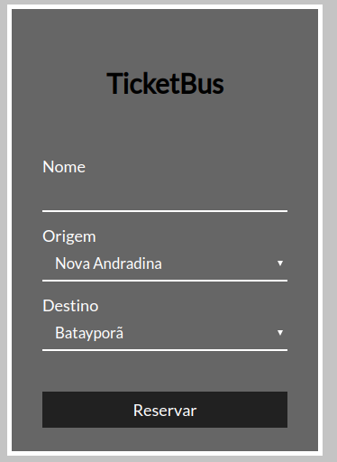
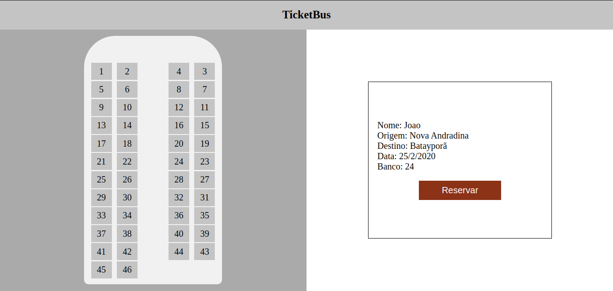

<h1 align="center">TicketBus</h1>

<strong>Projeto desenvolvido para a disciplina de desenvolvimento web I</strong>

Um site para a reserva de assentos de ônibus  

Site: [TicketBus](https://lucas-severo.github.io/ticketbus/)

<h1 align="center">Tecnologias</h1>

<li align="center">HTML, CSS, JAVASCRIPT</li>